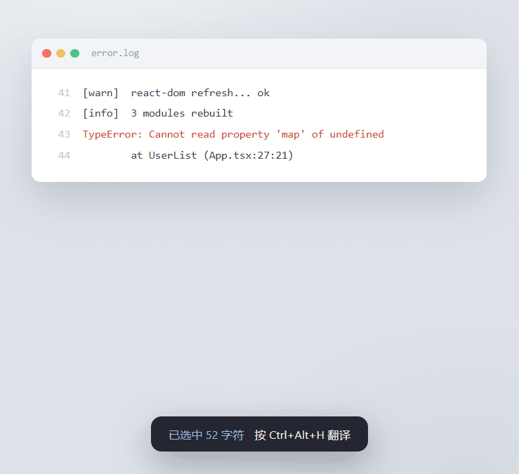

# Translate for Developers

[](https://github.com/SimplestBOT/translate-for-developers/actions/workflows/ci.yml)

<p align="center"></p>

[简体中文](README.md) · **English** · [日本語](README.ja.md) · [한국어](README.ko.md)

Select English text, press a hotkey, and the Chinese translation pops up instantly. Reading code comments, English docs, or paper abstracts — **works in any application**.

Stuck on an English comment in MATLAB? An English error message in VS Code? A tricky paragraph in a PDF?
Select → hotkey → translation appears right away. **Text you can't select — error screenshots, images, video subtitles — press the screenshot hotkey and box it instead.**

## Why this tool

Dictionary-style popup translators rely on reading the highlighted selection via UI automation, which **fails in apps like MATLAB (Java controls)**.
This tool uses the **clipboard approach** instead: after you select text it sends `Ctrl+C` automatically → reads the clipboard → translates → shows a popup.
It works in **every app that supports copying** — MATLAB, VS Code, browsers, PDF readers…

## Features

- Select text in any app → press the hotkey to translate (default `Ctrl+Alt+T`, changeable anytime)
- **Screenshot translation (v1.6)**: error screenshots, images, video subtitles — text you can't select. Press the screenshot hotkey (default `Ctrl+Alt+Z`, also in the tray menu) → drag a box → built-in Windows OCR (free, offline, zero dependencies) → auto-translate through the same result window
- **Input translation (v1.7)**: press `Ctrl+Alt+I` to open a multi-line input box, `Enter` to translate — for looking up errors, writing comments, naming variables
- **All-new dark UI (v1.1)**: rendered by the system's built-in WebView2 — glassy cards, entrance animations, scanning-beam loader, skeleton screens, springy keycap effects; translation is **asynchronous**, so the window opens instantly and animations never stutter
- **Automatic source-language detection** (manual selection also available), **30+ target languages** (Chinese, English, Japanese, Korean, French, German, Spanish, Russian…)
- Clipboard is backed up and restored automatically — **never destroys** what you had copied
- Choose your translation service: **MyMemory** (free, no registration) / **Baidu Translate** / **DeepL** / **AI LLM** (OpenAI-compatible: OpenAI/DeepSeek/Kimi/Zhipu/Ollama/custom)
- Long text is auto-split to bypass Baidu's 6000-byte per-request limit
- LLM translation protects code/paths/URLs/identifiers via placeholders (failed restore never returns silently)
- Polished interactions: draggable title bar, `Esc` to close, `Enter` to copy, copy button turns green with a checkmark, toast notifications in the corner (no more clunky message boxes)
- Tray menu: **change the hotkey (just press it on your keyboard)**, **switch translation service**, pick languages, exit
- Fully portable: C# host + WebView2 rendering (system-provided runtime), runs without installation

## Usage

1. Run `start-translator.bat` (or directly run `src/bridge/translator-ui.exe`) — a "T" icon appears in the system tray
2. **Select English text** in any app → press **`Ctrl+Alt+T`** → the translation window pops up
3. In the window: drag the title bar to move it; `Esc` closes; `Enter` or "Copy" copies the translation
4. Tray icon (T) → right-click menu: change hotkey / switch service / pick language / screenshot translation / input translation / exit
5. **Screenshot translation**: press `Ctrl+Alt+Z` (or the tray menu item) → drag a box around the region → release to OCR & translate; `Esc` or right-click cancels
6. **Input translation**: press `Ctrl+Alt+I` (or the tray menu item) → type or paste text → `Enter` translates (`Shift+Enter` for a new line)

## Configuration

Config file `config.conf` (in the `scripts/` folder next to `bridge/`, auto-created on first run):

```ini
hotkey=^!d              ; translation hotkey (changeable from the tray menu)
shot_hotkey=^!z         ; screenshot-translation hotkey (edit this file, restart host to apply)
input_hotkey=^!i        ; input-translation hotkey (edit this file, restart host to apply)
src_lang=auto           ; source language: auto = detect, or zh-CN/en/ja/ko/…
tgt_lang=zh-CN          ; target language (default: Simplified Chinese)
provider=mymemory       ; mymemory / baidu / deepl / llm
baidu_appid=            ; Baidu Translate APP ID (required for Baidu)
baidu_secret=           ; Baidu Translate secret (required for Baidu)
deepl_key=              ; DeepL API Key (required for DeepL)
deepl_endpoint=         ; optional Pro endpoint; empty = free endpoint
llm_preset=             ; AI LLM preset: openai/deepseek/kimi/zhipu/ollama/custom
llm_base_url=           ; OpenAI-compatible Base URL (e.g. https://api.deepseek.com/v1)
llm_api_key=            ; API Key (empty for local Ollama)
llm_model=              ; model name (e.g. gpt-4o-mini / deepseek-chat)
llm_prompt=             ; optional translation prompt; empty = built-in default
```

> Changing the hotkey or service from the tray menu writes to this file automatically — no manual editing needed. The screenshot hotkey (`shot_hotkey`) is file-level for now: edit it and restart the host.

> **Key security**: The Baidu APP ID / secret are encrypted with Windows **DPAPI** before being written to disk (`dpapi:` prefixed ciphertext, decryptable only by the current Windows account on this machine); copying `config.conf` to another machine cannot reveal the secret. Legacy plaintext files are migrated automatically at first startup. Diagnostic logs never contain key material; `config.conf` is excluded via `.gitignore` — never commit it manually.

## Supported languages

Source language is **auto-detected** by default (manual selection available); 30+ target languages:

| Language | Code | Language | Code |
|---|---|---|---|
| Simplified Chinese | zh-CN | English | en |
| Traditional Chinese | zh-TW | Japanese | ja |
| Korean | ko | French | fr |
| German | de | Spanish | es |
| Portuguese | pt | Russian | ru |
| Italian | it | Arabic | ar |
| Hindi | hi | Thai | th |
| Vietnamese | vi | Indonesian | id |
| Turkish | tr | Dutch | nl |
| Polish | pl | Ukrainian | uk |
| Greek | el | Czech | cs |
| Swedish | sv | Hungarian | hu |
| Romanian | ro | Danish | da |
| Finnish | fi | Norwegian | no |
| Malay | ms | Filipino | fil |
| Bengali | bn | Urdu | ur |
| Persian | fa | Hebrew | he |

> Tray menu → "Source language" / "Target language" submenus; your choice is saved automatically.

## System requirements

- Windows 10 1903+ (up to date) or Windows 11 (.NET Framework 4.8 runtime is built into the OS)
- WebView2 Runtime (**preinstalled on Win10/11** — most machines need no installation at all)

## Translation services

| Service | Cost | Registration | Notes |
|---|---|---|---|
| MyMemory | Free | Not required | ~50,000 chars/day, ~1s response |
| Baidu Translate | Free | Required | More consistent quality, long-text splitting supported |
| DeepL | 500k chars/month free | Required | High quality, 30+ languages, Pro endpoint supported |
| AI LLM | per provider | varies | OpenAI-compatible API; built-in DeepSeek/Kimi/Zhipu/Ollama presets; **developer content protection** (code/paths/URLs stay untranslated) |

**To enable the free Baidu tier**: fanyi-api.baidu.com → sign in → Console → Create app (General Text Translation / Standard)
→ copy the APP ID and secret → tray menu "Switch service" → Baidu → enter your credentials.

## Build from source

Requires the [.NET SDK](https://dotnet.microsoft.com) (any recent version; target is net48):

```
dotnet build src/csharp/TranslatorHost/TranslatorHost.csproj -c Release
```

Output lands in `src/csharp/TranslatorHost/bin/Release/net48/win-x64/`; copy that directory's contents into
`bridge/` (matching the path in `start-translator.bat`) and run. The frontend pages
(`src/webui/`, Vite + React 19 + TS) are built per page; the host automatically loads the output `webui/dist/<page>.html`.

### Debug switches

```
translator-ui.exe --selftest            ; headless self-test (WebView2 / config read-write)
translator-ui.exe --open result,text    ; debug window (auto-exits after 60s safety timeout)
TFD_HEADLESS=1                          ; no tray, no hotkey (sandbox e2e)
TFD_PIPE_NAME=<name>                    ; instance isolation key (parallel test instances)
TFD_TEST_REUSE=1                        ; auto-drive the result-window reuse flow
```

## Architecture (v1.7, migration complete)

- **C# host** (`src/csharp/TranslatorHost`, net48 + WinForms + WebView2): the one and only host —
  tray, global hotkeys (selection + screenshot translation), selection capture (terminal guard, UIA
  direct-read helper child process), screenshot translation (overlay region select → `Windows.Media.Ocr`),
  window lifecycle, WebView2, DWM rounded corners, native dragging.
  WinForms handles Windows integration only; no business logic in the Form.
- **Core library** (`src/csharp/TranslatorCore`): translation/providers/config/clipboard/HTTP/JSON,
  all async + CancellationToken.
- **UI pages** (`src/webui/`, React 19 + TypeScript): settings/result/capture/config/input, built as single files per page;
  communicates with the host over a JSON message protocol (contract in `docs/protocol.md`).
- The AHK version and the migration-era Named Pipe bridge were removed in v1.4/v1.5 respectively (backups not included in the repo).

## Directory layout

```
translate-for-developers/
├── README.md
├── LICENSE
├── .gitignore
├── start-translator.bat        # launcher (starts the C# host)
├── docs/                       # architecture / protocol / known-issues
└── src/
    ├── csharp/                 # C# host + core library + self-tests
    │   ├── TranslatorHost/     # WinForms/WebView2/tray/hotkey/selection capture
    │   ├── TranslatorCore/     # translation/providers/config/clipboard (class library)
    │   ├── TranslatorCore.Tests/  # built-in assertion self-tests (dotnet run)
    │   └── build-bridge.ps1    # build + deploy to bridge/
    ├── webui/                  # React 19 + TS frontend (single-file per page)
    │   ├── src/                # settings/result/capture/config + bridge protocol layer
    │   └── dist/               # build output <page>.html (self-contained)
    ├── icon.ico
    └── WebView2Loader.dll
```

## FAQ

- **Hotkey does nothing**: check the T icon is in the tray; make sure text containing English is selected
- **"No selected text detected"**: select the text first, then press the hotkey (in some apps, click the window once first so it has focus)
- **"Network request failed"**: check your network; MyMemory occasionally times out — click "Retry" in the window
- **Want a different service**: tray menu → switch translation service
- **Hotkey conflicts with another app**: tray menu → change hotkey → press your preferred combination
- **Screenshot translation says an OCR language pack is missing**: Windows Settings → Time & language → Language & region → Add a language → check the "Optical character recognition" optional feature (Win10/11 usually ships with Chinese & English)
- **Screenshot translation recognizes poorly**: the OCR language follows the "source language" setting (auto = system language); for English-only content set the source language to English. Very small text (under ~12px) has limited recognition
- **How to move the window**: drag it by the title bar at the top (the row with the logo)
- **"WebView2 not found" on first launch**: install the Evergreen Runtime once from [Microsoft's site](https://developer.microsoft.com/microsoft-edge/webview2/) (a normal Win10/11 doesn't need this)
- **Launch at startup (optional)**: put a shortcut to translator.exe into `shell:startup`

## License

[MIT](LICENSE)
